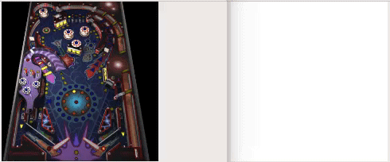

# Space Cadet Pinball Neural Network

We can all remember the bygone days of being bored after your dial-up Internet cut out. Luckily, [Space Cadet pinball](https://en.wikipedia.org/wiki/Full_Tilt!_Pinball#3D_Pinball_for_Windows_%E2%80%93_Space_Cadet) was always there to save us. The goal of this project is to create a neural network that can play Space Cadet pinball.

## Overview
1. Getting Data
2. Training the Neural Network
3. Results
4. Further Work

### Getting Data from the Space Cadet Program

Neural networks require input data. Typically for projects involving teaching a neural network how to play a video game, the game or emulator will output some data about the game state that can be fed into the network. However, in the case of this project, Space Cadet pinball is neither ran in an emulator nor is it open source. Therefore, there must be some wrapper script to pull data from the program.

To do this, [OpenCV](https://opencv.org/) in Python was used. The pinball game is opened, then the script initialized. It screenshots the game window using [MSS](https://readthedocs.org/projects/python-mss/) at 30 screenshots per second. Then, the screenshot of the game window is preprocessed in a variety of ways. First, the screenshot is thresholded such that only gray values remain. Then, this picture is compared to the last gray-only frame using [`scikit-image.measure.compare_ssim`](https://scikit-image.org/docs/dev/api/skimage.measure.html#skimage.measure.compare_ssim), which computes the mean structural similarity between two images. In simpler language, all this step is doing is finding where the ball is and how fast it is moving. Below is a demostration of the ball tracking technology.

This output can be simplified further, as seen on the right below.

Now, we could use this as input into a neural network and eventually see results. However, for the time line of this project, this amount of computational power and time was not available. Thus, this output was simplified even further by extracting the x and y positions of the ball and also calculating the horizontal and vertical velocities of the ball by looking at the distance traveled from the last position.

### Training the Neural Network
Usually, a neural network is trained using back propagation with gradient descent. However, our model has two outputs: one flips the left flipper, and the other flips the right flipper. These outputs have no expected value, which is a requirement for gradient descent. In this case, we must use reinforcement learning. Reinforcement learning is the process of teaching a computer to improve at an action by giving it rewards for correct actions and punishing it whenever it fails. More specifically, a [genetic algorithm](https://towardsdatascience.com/introduction-to-genetic-algorithms-including-example-code-e396e98d8bf3) was used to select neural networks that were best at playing pinball. Genetic algorithms attempt to adjust the weights of the neural networks by using the biological theories of evolution and natural selection.

The architecture of every neural network was consistent. Every model takes 4 inputs, the x-position, y-position, x-velocity, and y-velocity. Each model has 3 hidden layers with 8 neurons each and the `relu` activation function. There are 2 outputs using the `sigmoid` activation function.

To start, 20 neural networks were generated with the above architecture and completely random weights. These neural networks play one game of pinball each and have their fitness computed. The fitness of a model measures how well it performed. The fitness equation for this project was initially just the score in game, however it was quickly found that bad models could rack up many points through pure luck. Instead, the equation is `(2 * frameCount) - inputCount`. `frameCount` is the total amount of frames elapsed. `inputCount` is the amount of inputs sent by the neural network. The minimum score a model can receive is a 0, if it inputs two flips per frame every frame.

The best three models from this initial stage are chosen to breed, and the rest are discarded. 20 children models are created by grabbing random weights from the best three, with the models with greater fitness having a greater chance to pass down their weights. Additionally, every weight has a 10% chance of having its value randomly shifted, called mutation. This next generation of networks then plays a game of pinball each, is assigned a fitness score, and the best three create offspring. This process repeats as long as the user wants.

### Results

The first generation of neural networks started off with no idea how to play pinball. It random hit the flippers and had a fairly poor performance. Below is a video of ball one for the best model of the first generation.

However, the models started to learn fast. Below is a graph showing the average fitness for the 20 models of each generation.

Some generations performed worse than their ancestors, but in general the average fitness tends to increase as the generations go on. Below is a graph showing the fitness of the best model of each generation.

The models stagnate for around 15 generations from ten to twenty-five, but at the end of training, the best fitness begins to skyrocket. Below is a clip from the best model playing.

### Further Work
Right now, due to the nature of grabbing the screen, these scripts require the pinball game window to be placed a very specific position. This could be improved to automatically find the pinball window and update values accordingly. Next, the genetic algorithm could be improved by playing 3 games per model, or more, to decrease the chance that a bad model gets a lucky good score or a bad model gets snubbed by an unfortunate bounce. Instead of using a set architecture for the neural networks, these could also be manipulated by the genetic algorithm. Furthermore, more attributes of the game board can be input into the network, for example which lights are turned on.

Finally, many more generations could be created to improve performance. Each generation takes around 20 minutes to play through on my machine. Finding a way to parallelize this process would greatly speed up the process.
